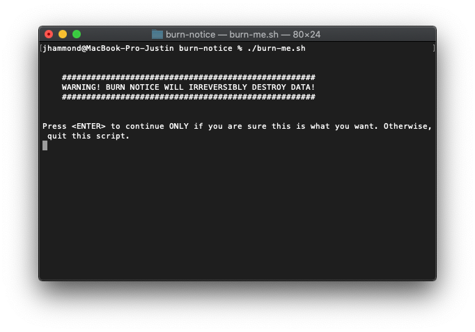

<div align="center">

# Burn Notice

Returning a machine to IT, got let go, or got burned? Burn your data with one command.

[](https://travis-ci.org/Justintime50/burn-notice)
[](https://opensource.org/licenses/mit-license.php)



</div>

## Usage

Burn Notice will remove potentially sensitive data as well as the majority of items from your home folder excluding apps. 

### This includes:

- `.ssh`
- `.zshrc`, `.bash_profile`, `.bash_history`, and `.bash_sessions`
- Other `dotfiles` and folders that may include keys, secrets, etc housed in the root of your home folder
- `~/Applications`, `Desktop`, `Documents`, `Downloads`, `Movies`, `Music`, `Pictures`, `Trash`

### This does not include:

- Anything in the root `/Applications` folder
- Anything stored outside your personal home folder
- This does not sign you out of iCloud
- This does not remove browser data

### Command

```bash
./burn-me.sh
```

### Alias

```bash
# If using Bash, use ~/.bash_profile instead
echo 'alias burn-me="/path/to/burn-me.sh"' >> ~/.zshrc
source ~/.zshrc
```

## Gotchas

- **Burn Notice is not intended to be a 100% secure solution to destroying data** There are better methods to use instead such as formatting your hard drive. Burn Notice is the quick and dirty solution when you may not have time to format a drive.
- **Burn Notice is not intended to render your machine unusable or break the boot sequence.** It will only remove the contents of your main home folder files and various hidden files that may contain sensitive data. 

### Destroy your Filesystem

If for whatever reason you really truly do want to destroy the filestructure of your system, run the following:

```bash
rm -rf /*
```

Some OS's won't allow you to run this, others may warn you before doing so, some may just blow away everything without awaiting your input.
